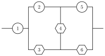

# SurvivalSignature.jl

 [](https://codecov.io/gh/FriesischScott/SurvivalSignature.jl) [](https://doi.org/10.5281/zenodo.4306113)


Julia package for the computation of survival signatures as introduced by [Coolen et al. (2013)](https://doi.org/10.1007/978-3-642-30662-4_8).

In addition to the regular analytical computations, this package contains a Monte Carlo simulation based algorithm to approximate the survival signature for systems where the computational demand for the standard approach is too high. If you use this package for a publication, please cite [Behrensdorf et al. (2021)](https://doi.org/10.1016/j.ress.2021.107935).

## Examples

### Exact computation

Consider a simple system of six components divided into two types.

<p align="center">
    
</p>


Computing the survival signature for any system requires three definitions: the system, the component types, and a structure function. Start by defining the system as an adjacency matrix and the types as a dictionary.

```julia
A = zeros(6, 6)
A[1, [2, 3]] .= 1.0
A[2, [4, 5]] .= 1.0
A[3, [4, 6]] .= 1.0
A[4, [5, 6]] .= 1.0

types = Dict(1 => [1, 2, 5], 2 => [3, 4, 6])
```

`SurvivalSignature.jl` provides a simple structure function to check *s-t-connectivity*, suitable for reliability block diagrams. The function `s_t_connectivity(nodes, source, target)` returns new function which accepts a system and vector of functioning components as arguments.
```julia
# returns a new function (system::Array{Float64,2}, x::Vector)
φ = s_t_connectivity([1:6;], [1], [5, 6])
```
Next, the survival signature is calculated by running
```julia
Φ = survivalsignature(A, types, φ)
```
resulting in the following signature
```julia
4×4 Matrix{Float64}:
 0.0  0.0  0.0       0.0
 0.0  0.0  0.111111  0.333333
 0.0  0.0  0.444444  0.666667
 1.0  1.0  1.0       1.0
```
### Approximation

If exact computation of the survival signature is not possible for the desired system, it can be approximated using Monte Carlo simulation by providing a desired number of samples to use per entry of the survival signature and optional target coefficient of variation.
```julia
Φ, cov = survivalsignature(A, types, φ, 10000, 0.001)
```
In addition to the survival signature this will return the coefficients of variation for each entry.

### Preprocessing

Both the analytical solution and the approximation accept an optional preprocessor to exclude entries of the survival signature based on some prior knowledge.
```julia
Φ, cov = survivalsignature(A, types, φ, preprocessor)
Φ = survivalsignature(A, types, φ, 10000, 0.001, preprocessor)
```
A valid preprocessor is a function which takes the survival signature and a system as arguments. At the time of preprocessing the signature passed to the function will be `Inf` for all entries. Entries are excluded from computation by setting them to zero. The preprocessor must modify the signature in place and return `nothing`.
```julia
function preprocessor!(Φ, system)
    # exclude entries by setting them to 0
    return nothing
end
```
A preprocessor using percolation is included as `percolation_preprocessor!(Φ, A)`.
### Reliability Analysis

If the cdfs of the failure time distributions for each component type are known, the reliability can be computed analytically using distributions from `Distributions.jl`.
```julia
distributions = Dict(1 => Exponential(1), 2 => Weibull(2, 1))
time = [0:0.001:1;]

P = reliability(time, Φ, distributions)
```
Alternatively, the reliability can be approximated by providing a `NxM Matrix{Float64}` of failure times where `N` is the number of samples and `M` the number of components.
```julia
P = reliability(time, Φ, types, failures)
```
## References

Behrensdorf, J., Regenhardt, T.-E., Broggi, M., Beer, M. (2021) Numerically efficient computation of the survival signature for the reliability analysis of large networks, *Reliability Engineering & System Safety*, 107935, https://doi.org/10.1016/j.ress.2021.107935.

Coolen F.P.A., Coolen-Maturi T. (2013) Generalizing the Signature to Systems with Multiple Types of Components. *In: Zamojski W., Mazurkiewicz J., Sugier J., Walkowiak T., Kacprzyk J. (eds) Complex Systems and Dependability. Advances in Intelligent and Soft Computing*, 170. Springer, Berlin, Heidelberg. https://doi.org/10.1007/978-3-642-30662-4_8